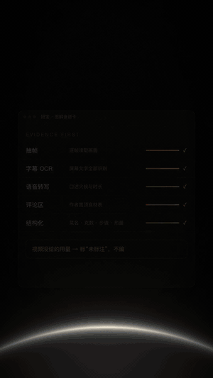
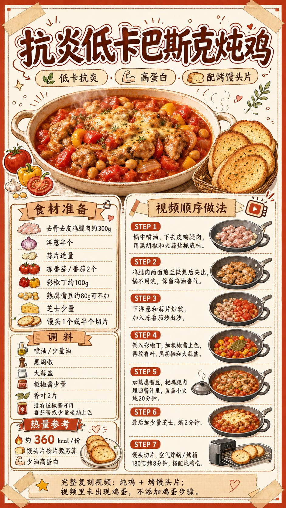
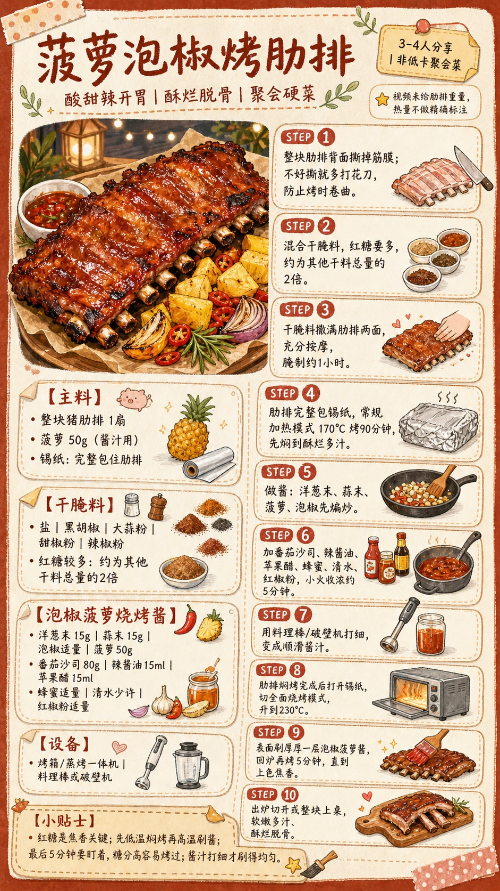
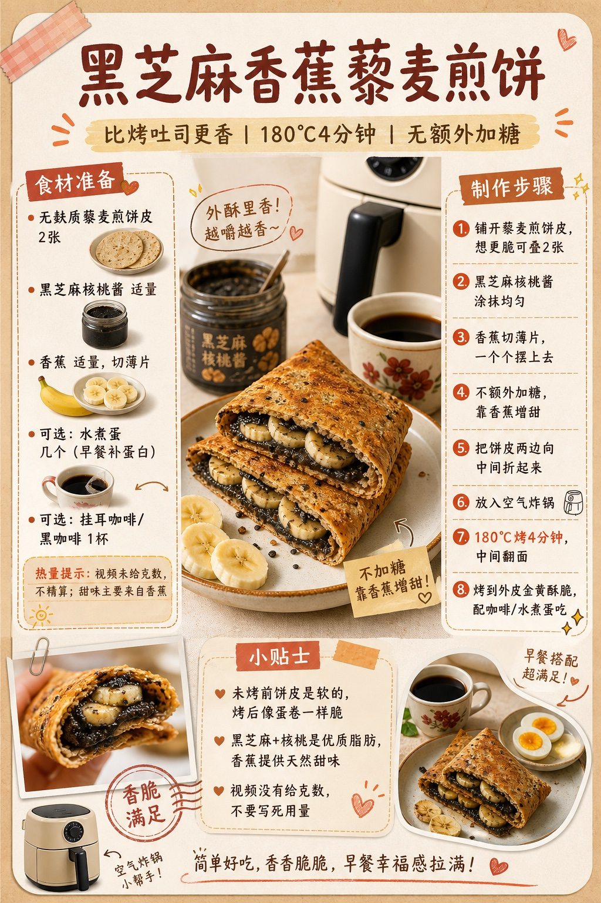
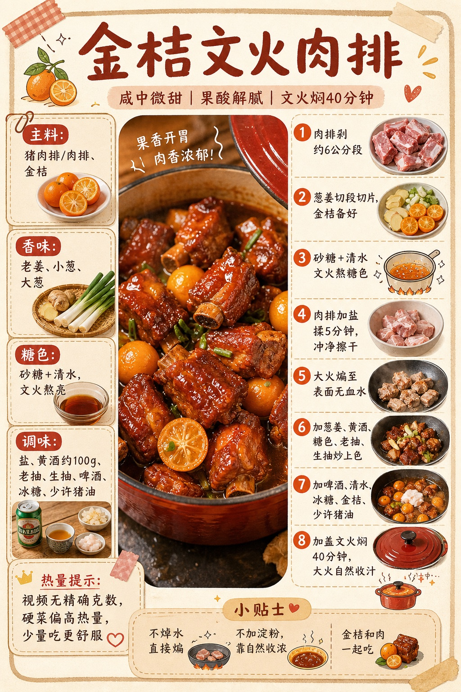

<div align="center">

# 🍳 recipe-video-cards · 妞宝图解食谱卡

**把小红书 / 抖音 / B 站的做饭视频，变成一张照着就能做的图解食谱卡。**

一个开源 Agent Skill，装进 Hermes、Claude Code 或任何支持 Skills 的 AI 助手即可使用。

[English](#english) · [安装](#-安装) · [工作流程](#-工作流程) · [示例](#-示例) · [常见问题](#-常见问题)



[▶ 观看 56 秒宣传片](docs/promo-720p.mp4)

</div>

---

## ✨ 它能做什么

收藏了几百个做饭视频，真要做的时候：克数记不住，步骤要反复拖进度条，热量更是没谱。

把链接丢给装了这个 Skill 的 AI 助手，它会：

- **先取证，再成卡**：抽帧看画面、OCR 读字幕、转写口述、翻作者置顶的评论区食材表
- **一个克数都不编**：视频没给的用量，明确写「原视频未标注」，不拿常识冒充事实
- **结构化**：菜名、份量、分组食材、调料、STEP 1–6、火候时长、热量，先存成 JSON
- **一张卡说清**：大幅水彩成品图 + 左栏食材 + 右栏手绘步骤 + 热量徽章，手账风版式
- **生图后验图**：用多模态模型逐项核对图上的文字和数字，不通过就重画
- **一菜一卡**：一个视频里有四道菜，就出四张卡

<table>
<tr>
<td align="center" width="50%"><br><sub>咸蛋黄麻薯巴斯克月饼 · 约 160 kcal/个<br>原作者：小红书 @徐也没</sub></td>
<td align="center" width="50%"><br><sub>抗炎低卡巴斯克炖鸡 · 配烤馒头片<br>原作者：小红书 @发福小勇（减脂版）</sub></td>
</tr>
</table>

宣传片里拆的三个真实视频，成卡如下：

<table>
<tr>
<td align="center" width="33%"><br><sub>菠萝泡椒烤肋排 · 3–4 人聚会硬菜<br>原作者：小红书 <a href="https://www.xiaohongshu.com/explore/6a0ad84700000000370354fa">@文森特别饿</a></sub></td>
<td align="center" width="33%"><br><sub>黑芝麻香蕉藜麦煎饼 · 无额外加糖<br>原作者：抖音 <a href="https://www.douyin.com/video/7614104216894135025">@Mickey</a></sub></td>
<td align="center" width="33%"><br><sub>金桔文火肉排 · 文火焖 40 分钟<br>原作者：抖音 <a href="https://www.douyin.com/video/7649281904956493107">@老饭骨</a></sub></td>
</tr>
</table>

## 📦 安装

### Hermes Agent

```bash
git clone https://github.com/mirandakaro/recipe-video-cards.git ~/.hermes/skills/recipe-video-cards
```

### Claude Code

```bash
# 个人级（所有项目可用）
git clone https://github.com/mirandakaro/recipe-video-cards.git ~/.claude/skills/recipe-video-cards
# 或项目级
git clone https://github.com/mirandakaro/recipe-video-cards.git .claude/skills/recipe-video-cards
```

### 其他 Agent / 不支持 Skills 的应用

把 `SKILL.md` 作为系统提示词或项目规则导入，同时上传：

- `references/golden-layout.md`
- `references/evidence-pipeline.md`
- `references/qa-checklist.md`
- `assets/golden-reference.png`

只能上传一个文件时，优先上传 `SKILL.md`。

## 🚀 使用

新对话里直接说：

> 把这个小红书链接做成图解食谱卡：https://xhslink.com/...

或者显式加载：

> 加载 recipe-video-cards。先读真实视频证据、OCR 和转写，不许编克数；按 golden 手账版式生成，验图不通过就重做，最后直接展示 PNG。

也支持：截图 / 教程长图、已确认的菜单文字、一个视频里的多道菜。

## 🔍 工作流程

```text
链接 / 视频 / 截图
   │
   ▼
A 取证   解析真实帖子 → 下载媒体 → 标题、正文、作者回复
   │
   ▼
B 证据包 粗抽帧看全程 → 关键段密抽帧 → OCR → 语音转写 → 交叉核对
   │
   ▼
C 结构化 recipe.json（templates/recipe.schema.json）
   │      缺失字段 → 「原视频未标注」
   ▼
D 写提示词 templates/image-prompt-template.md + golden 版式
   │
   ▼
E 生图   优先 GPT Image 2 / 同等中文渲染能力的模型，带参考图
   │
   ▼
F 验图   对照 JSON + references/qa-checklist.md，不通过就重画
   │
   ▼
交付实际 PNG
```

## 🧰 需要的能力

| 能力 | 用途 | 常见实现 |
|---|---|---|
| 浏览器 / 网页访问 | 解析短链、读正文和评论 | 自带浏览器工具、OpenCLI |
| 媒体下载 | 拿到原视频 | 平台下载器、yt-dlp |
| 抽帧 | 看画面、拼接触表 | ffmpeg |
| OCR / 多模态视觉 | 读字幕叠字、验图 | GPT-5 系列、Claude、Gemini |
| 语音转写 | 口述的火候和时长 | Whisper 等 |
| 图像生成 | 画卡片 | **GPT Image 2（推荐）** 或其他能稳定写中文的模型 |

缺哪一项，Skill 会要求 Agent 如实说明，不能假装看过视频、读过评论或验过图。

## 📁 目录结构

```text
recipe-video-cards/
├── SKILL.md                         主技能说明（入口）
├── references/
│   ├── golden-layout.md             Golden 手账版式标准
│   ├── evidence-pipeline.md         取证与不确定性规则
│   ├── platform-recovery.md         小红书 / 抖音访问回退
│   └── qa-checklist.md              生图验收门槛
├── templates/
│   ├── recipe.schema.json           结构化食谱 JSON Schema
│   └── image-prompt-template.md     生图提示词模板
├── assets/
│   ├── golden-reference.png         版式参考图（生图时作为参考图传入）
│   ├── example-output-mooncake.png  示例成品：咸蛋黄麻薯巴斯克月饼
│   └── example-output-basque-chicken.png 示例成品：抗炎低卡巴斯克炖鸡
├── evals/evals.json                 验证 Agent 是否真正执行的测试题
└── docs/                            README 用的预览图和宣传片
```

## ✅ 验证安装

用 `evals/evals.json` 里的 4 道测试题跑一遍。执行正确的 Agent 应该：

1. 先取证，而不是直接生图
2. 缺失克数不编造，即使用户说「按常见分量补齐」
3. 创作者给的热量保留「作者口径」
4. 使用 golden 手账版式，而不是普通海报 / PPT / 六宫格
5. 生图后做视觉验收
6. 最后交付实际 PNG 文件

## ❓ 常见问题

**为什么不直接让模型「按经验」补克数？**
因为这张卡是要照着做的。编出来的克数看着合理，做出来可能完全不对。这个 Skill 宁可写「未标注」。

**热量准吗？**
创作者给的热量会标「作者口径」；自行估算的会写明依据。本项目不提供营养或医疗建议。

**可以不用 GPT Image 2 吗？**
可以，但需要能稳定渲染中文小字的模型。Skill 禁止用 PIL / SVG / HTML 手工拼图来冒充生成结果。

**小红书链接打不开？**
见 `references/platform-recovery.md`：短链解析失败时，改用浏览器打开完整签名链接，或请用户提供截图 / 保存的视频。

## ⚖️ 使用须知

- 本项目的 skill 本身只包含方法与版式说明，**不附带任何第三方视频或图文内容**；`docs/` 下的宣传片与示例卡中用到的原视频片段，出处见下方「示例版权说明」。
- 请尊重原创作者：生成的卡片仅供个人学习与做饭参考；二次发布前请取得原作者授权，并注明出处。
- 使用平台登录态抓取内容时，请遵守对应平台的服务条款。
- 热量与营养数据仅供参考，不构成营养或医疗建议。

## 🙏 示例版权说明

仓库里的示例卡，是用本 skill 按原视频/笔记整理的复刻图解，食谱内容版权归原作者所有，仅作功能演示：

- **咸蛋黄麻薯巴斯克月饼**：小红书 [@徐也没](https://www.xiaohongshu.com/explore/6aa52d76000000002901b724)，笔记《它只有160kcal啊🥹今年月饼届顶流出现了！！》
- **抗炎低卡巴斯克炖鸡**：小红书 [@发福小勇（减脂版）](https://www.xiaohongshu.com/explore/6a104df50000000036018c74)，巴斯克炖鸡视频笔记

宣传片（`docs/promo-720p.mp4`）和上面三张卡用真实视频演示了拆解流程，片中出现的原视频片段、字幕与画面归原作者所有，仅作功能演示：

- **菠萝泡椒烤肋排**（全片主线，抽帧 / 字幕 / 屏幕配料 / 步骤片段）：小红书 [@文森特别饿](https://www.xiaohongshu.com/explore/6a0ad84700000000370354fa)，《酥烂脱骨，酸甜辣超过瘾的菠萝烤肋排！🔥》
- **黑芝麻香蕉煎饼**：抖音 [@Mickey](https://www.douyin.com/video/7614104216894135025)，《是真的比烤吐司还要好吃，黑芝麻和香蕉只有0次和无数次》
- **金桔文火肉排**：抖音 [@老饭骨](https://www.douyin.com/video/7649281904956493107)，《膨胀了！能学到普京爱吃的同款菜！金桔文火肉排！》

原作者如不希望在此展示，请提 Issue，会第一时间撤下。

## 📄 License

[MIT](LICENSE)

---

<a id="english"></a>

## English

**recipe-video-cards** is an open-source Agent Skill that turns cooking videos from Xiaohongshu (RedNote), Douyin, Bilibili and more into evidence-grounded, illustrated Chinese recipe cards.

- **Evidence first**: frame extraction, OCR on overlays, speech transcription, and the creator's pinned comment are cross-checked before anything is written.
- **No invented quantities**: missing grams, times or temperatures are marked `原视频未标注` (not stated in source).
- **Structured**: each dish becomes a JSON record (`templates/recipe.schema.json`) before image generation.
- **Golden scrapbook layout**: a watercolor hero dish, ingredient boxes, STEP 1–6 illustrated steps, and a kcal badge.
- **Pixel QA**: the generated card is re-read by a vision model against the JSON and regenerated on any error.

Install by cloning into your agent's skills folder (e.g. `~/.claude/skills/` or `~/.hermes/skills/`). A strong Chinese-capable image model such as GPT Image 2 is recommended. Licensed under MIT.
